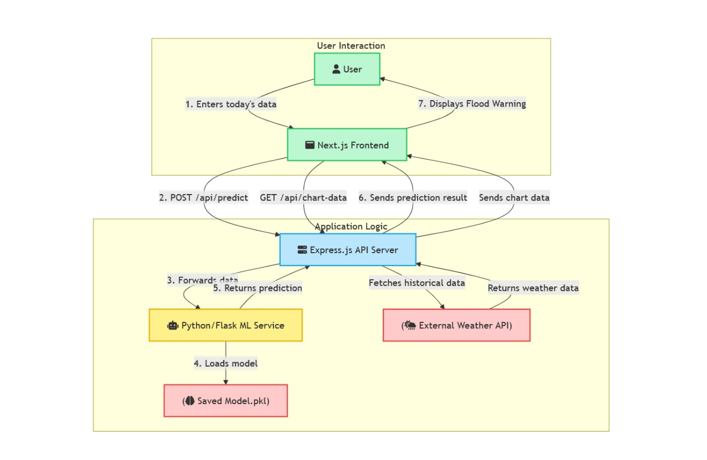

# 🌊 Flood Prediction App

An end-to-end **AI-powered Flood Risk Prediction System** that integrates **Machine Learning (Flask)**, **Express.js (Node.js)**, and **Next.js (React)** — providing real-time flood forecasting based on weather and location data.

---

## 🚀 Overview

This system predicts flood risk using environmental parameters such as:
- 🌧️ Rainfall (mm)
- 🌡️ Temperature (°C)
- 💧 Humidity (%)
- 🏔️ Elevation (m)
- 🗺️ District
- 🗓️ Month

It automatically detects the user's location, fetches live weather data, and predicts both today's and the next 7 days' flood probability.

---

## 🧠 Tech Stack

| Layer | Technology | Purpose |
|-------|-------------|----------|
| **Frontend** | Next.js (React) | User interface, location detection, prediction dashboard |
| **Backend** | Express.js | API middleware between Flask and frontend |
| **ML Service** | Flask + Scikit-learn | Model prediction endpoint |
| **Dataset** | CSV (India districts data) | Training and feature data |
| **External API** | Open-Meteo | Real-time weather data |

---

## 📂 Folder Structure

```plaintext
/flood-prediction-app/
│
├── 📂 ml-service/                        # 🧠 Machine Learning + Flask API
│   ├── app.py                            # Flask app exposing /predict
│   ├── model.pkl                         # Trained model file
│   ├── requirements.txt                  # Python dependencies
│   ├── train_model.ipynb                 # Jupyter notebook (training)
│   ├── 📂 data/
│   │   ├── raw/
│   │   │   └── india_districts_2500.csv  # Original dataset
│   │   └── processed/
│   │       └── flood_cleaned.csv         # Cleaned dataset for ML
│   └── 📂 notebooks/
│       ├── 1-Data_Exploration.ipynb
│       └── 2-Model_Training.ipynb
│
├── 📂 api-server/                        # 🌐 Express.js middleware API
│   ├── app.js                            # Main Express entry
│   ├── 📂 routes/
│   │   ├── weather.js                    # Fetches weather (Open-Meteo)
│   │   └── predict.js                    # Connects to Flask ML API
│   ├── package.json                      # Dependencies
│   └── .env                              # Optional environment config
│
├── 📂 client/                            # 💻 Next.js frontend
│   ├── package.json                      # Frontend dependencies
│   ├── next.config.js                    # Next.js config
│   ├── 📂 src/
│   │   ├── app/
│   │   │   ├── layout.jsx
│   │   │   ├── page.jsx
│   │   │   ├── globals.css
│   │   │   └── 📂 components/
│   │   │       ├── InputForm/
│   │   │       │   ├── InputForm.jsx
│   │   │       │   └── InputForm.module.css
│   │   │       └── ChartDisplay/
│   │   │           ├── ChartDisplay.jsx
│   │   │           └── ChartDisplay.module.css
│   │   └── 📂 utils/
│   │       ├── districtMap.js            # Maps OSM names → dataset names
│   │       └── districtList.js           # (optional dropdown list)
│
├── sys_design.jpg                        # System architecture diagram
├── .gitignore
└── README.md
```

---

## ⚙️ System Design



### Workflow
1. 🌍 User opens the web app (Next.js)
2. 🛰️ Browser auto-detects location  
3. 🌦️ Express backend fetches weather data from Open-Meteo  
4. 🗺️ District name standardized via `districtMap.js`  
5. 📤 Request sent to Flask model  
6. 🧠 ML model predicts flood likelihood  
7. 📊 Frontend displays today's & next 7 days' results with charts

---

## 🧩 Setup & Installation

### 1️⃣ Clone the Project
```bash
git clone https://github.com/saikumar178/Flood-prediction-app.git
cd Flood-prediction-app
```

---

### 2️⃣ 🧠 Setup the ML Service (Flask)

```bash
cd ml-service
python -m venv venv
# Activate the virtual environment
venv\Scripts\activate       # (Windows)
source venv/bin/activate      # (Linux/Mac)

pip install -r requirements.txt
python app.py
```

**Flask runs at:**  
👉 `http://127.0.0.1:5000/predict`

---

### 3️⃣ ⚙️ Setup the API Server (Express.js)

```bash
cd ../api-server
npm install
node app.js
```

**Express runs at:**  
👉 `http://localhost:3001`  
Routes:
- `/api/weather` → fetches weather data  
- `/api/predict` → communicates with Flask

---

### 4️⃣ 💻 Setup the Frontend (Next.js)

```bash
cd ../client
npm install
npm run dev
```

**Frontend runs at:**  
👉 `http://localhost:3000`

---

## 🧮 Flask API Example

**POST Request:**  
`http://127.0.0.1:5000/predict`

**Body Example:**
```json
{
  "district": "Mysore",
  "month": 7,
  "rainfall": 250,
  "temperature": 29,
  "humidity": 84,
  "elevation": 700
}
```

**Response Example:**
```json
{
  "prediction": "Flood Likely",
  "probability": 0.87
}
```

---

## 🌦️ Express Weather API Example

**GET Request:**  
`http://localhost:3001/api/weather?lat=12.97&lon=77.59`

**Response Example:**
```json
{
  "current": {
    "temperature_2m": 29,
    "relative_humidity_2m": 78,
    "precipitation": 10
  },
  "future": [
    {
      "date": "2025-11-10",
      "temp": 30.1,
      "humidity": 76,
      "rain": 5.2
    }
  ]
}
```

---

## 🧰 Dependencies

### 🧠 Flask (`ml-service/requirements.txt`)
```
Flask
scikit-learn
pandas
numpy
joblib
```

### ⚙️ Express (`api-server/package.json`)
```
{
  "dependencies": {
    "express": "^4.18.2",
    "axios": "^1.6.8",
    "cors": "^2.8.5",
    "dotenv": "^16.3.1"
  }
}
```

### 💻 Next.js (`client/package.json`)
```
{
  "dependencies": {
    "next": "14.1.0",
    "react": "18.2.0",
    "react-dom": "18.2.0",
    "chart.js": "^4.4.0",
    "react-chartjs-2": "^5.2.0"
  }
}
```

---

## 🧪 Model Training

Train and save your model from Jupyter:

1. Open `/ml-service/notebooks/2-Model_Training.ipynb`
2. Clean & process the dataset:
   - Input: `/ml-service/data/raw/india_districts_2500.csv`
   - Output: `/ml-service/data/processed/flood_cleaned.csv`
3. Train your model using RandomForestClassifier
4. Save the model:
   ```python
   joblib.dump(model, "model.pkl")
   ```
5. Move it to `/ml-service/model.pkl`

---

## 🗺️ districtMap.js Example

**File:** `client/src/utils/districtMap.js`

```js
export const districtMap = {
  "Mysuru district": "Mysore",
  "Bangalore Urban": "Bengaluru Urban",
  "Trichy": "Tiruchirappalli",
  "Trivandrum": "Thiruvananthapuram",
  "Mumbai Suburban": "Mumbai",
  "Pune district": "Pune"
};
```

---

## 🧭 Environment Variables

In `/api-server/.env`:

```
FLASK_URL=http://127.0.0.1:5000
PORT=3001
```

---

## 💡 Common Commands

| Command | Description |
|----------|-------------|
| `python app.py` | Run Flask ML service |
| `node app.js` | Run Express backend |
| `npm run dev` | Run Next.js frontend |
| `jupyter notebook` | Open notebooks |

---

## 🌟 Future Improvements

- Integrate large flood records for better model accuracy  
- Add rainfall radar visualization  
- Deploy APIs to Render or Railway  
- Add SMS/email flood alerts  
- Cloud-hosted model for scale  

---

## 🧑‍💻 Author

**S S Sai Kumar**  
💻 Full-Stack Developer & ML Enthusiast  
🌍 India  
🚀 Focused on building tech for disaster management

---

## 🏁 License

MIT License © 2025 — Open for academic and non-commercial use.